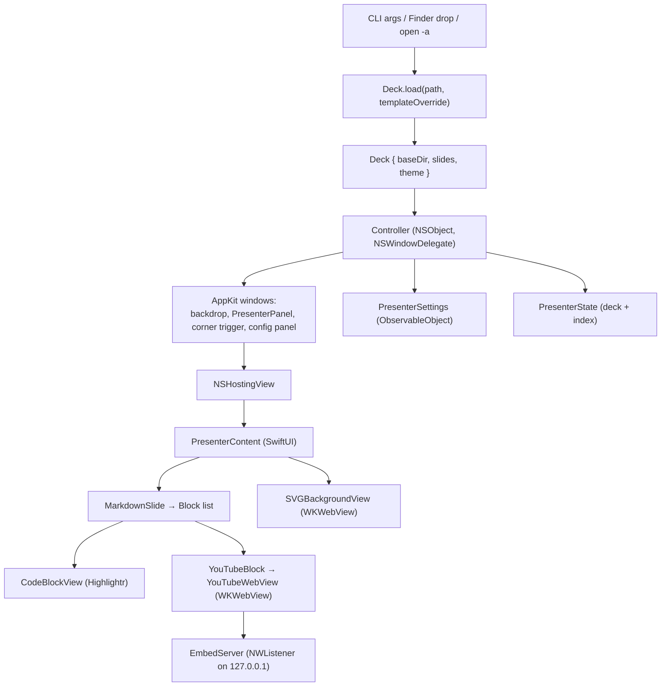

# architecture

How Screen Presenter is wired together: one Swift file, an AppKit window layer, a SwiftUI content layer, and a loopback HTTP server.

## Shape

A SwiftPM executable target (`Package.swift`) whose entire implementation is
`Sources/ScreenPresenter/main.swift` (~1500 lines). Bundled fonts ship as a
SwiftPM resource directory (`Sources/ScreenPresenter/Fonts/`). There are no
other source files and no tests — it is a UI app, verified by running it.

Third-party dependency: Highlightr (syntax highlighting). Everything else is
AppKit, SwiftUI, WebKit, and Network.framework.

## Layers

## Reading order inside main.swift

1. `FontLoader` — registers `.ttf`/`.otf` from the bundled `Fonts/` directory
   at launch, checking both `.main` and `.module` bundles.
2. `DeckTheme` — palette + font name + template name; a static dictionary of
   10 bundled themes built with private `rgb(r,g,b,a)` / `gray(w,a)` helpers.
   `DeckTheme.default()` returns the `dark` theme.
3. `Slide` — `background: String?`, `columns: [String]`, `themeOverride:
   DeckTheme?`. `Slide.parse` pulls the `<!-- bg: ... -->` directive and
   splits columns on a `|||` line.
4. `Deck` — `baseDir`, `slides`, `theme`. `Deck.load` dispatches to
   `loadFolder` for directories, otherwise splits markdown on `\n---\n`,
   extracts a leading theme block, and applies the CLI override.
5. `PresenterSettings` — observable: `fontName`, `baseFontSize`, per-slide
   shade, and the deck-level `theme`.
6. `VideoPlayback` — observable holding the currently playing video, if any.
7. `Block` / `MarkdownSlide` — a hand-rolled line-by-line block parser (no
   Markdown library) plus the SwiftUI renderer. Takes a `theme` parameter so
   per-slide overrides reach text and code.
8. `CodeBlockView` — Highlightr with the fixed `atom-one-dark` syntax theme.
9. `YouTubeLink` / `YouTubeBlock` / `YouTubeWebView` / `PassiveWebView` —
   thumbnail, play promotion, and the `WKWebView` that hosts the IFrame API.
10. `SVGBackgroundView` — a `WKWebView` used to rasterize SVG backgrounds. It
    starts at `alphaValue = 0` and its coordinator (the navigation delegate)
    fades it in over 0.4s on `didFinish`, since a web view paints nothing
    until the load completes and the background would otherwise pop in.
11. `EmbedServer` — a singleton `NWListener` bound to `127.0.0.1:<random>`
    that serves the YouTube embed page over real http.
12. `PresenterState` — the deck plus the current slide index.
13. `PresenterPanel` / `CornerView` — the borderless `NSPanel` subclass with
    an `onKey` callback, and the hover-target view.
14. `PresenterContent` — the SwiftUI view tree. `currentTheme` resolves the
    slide's override, falling back to the deck theme.
15. `ConfigPanelView` — the live-config controls.
16. `Controller` — owns every window, keyboard handling, deck reloading, and
    the macOS activation-policy flip.
17. `AppDelegateShim` — receives Finder file/folder opens.

## Data flow for a keystroke

`PresenterPanel.keyDown` → `onKey(code)` closure → `Controller.handleKey` →
mutates `PresenterState.index` (or dismisses / closes a playing video) →
SwiftUI re-renders `PresenterContent` for the new slide.

## Entry points and argument parsing

Three ways a deck reaches the app:

1. **CLI** — the parser scans `CommandLine.arguments.dropFirst()`, taking the
   first positional argument as the deck path and `template=NAME` as a theme
   override. Dev builds only.
2. **Finder** — dropping a `.md` file (or a folder) on the app, "Open With",
   or `open -a ScreenPresenter.app deck.md`.
3. **Resume** — the last deck path is persisted under `lastDeckPath`.

The `template=NAME` override is deliberately **not** stored on the app
delegate. It applies only to the deck it launched with; a file dropped onto
the already-running app uses whatever that file's own `## Theme` block
declares, with no override.

## Data flow for a file drop

Finder → `AppDelegateShim.application(_:open:)` → `Controller.loadDeck(from:)`
→ `Deck.load` → replaces `state.deck`, resets `state.index` to 0, clears the
playing video, sets `settings.theme` to the new deck's theme, resets
`settings.fontName` to `"System"`, clears per-slide shades, persists the path
under the `lastDeckPath` user default, and shows the panel.

## Where state lives

- **Persistent** (`UserDefaults`): `lastDeckPath`, and the last viewed slide
  index so reopening resumes where you left off.
- **Session** (`PresenterSettings`): font name, base font size, per-slide
  shade. Reset on quit and on deck load.
- **Transient** (`VideoPlayback`): which video, if any, is currently expanded
  to fill the panel.
