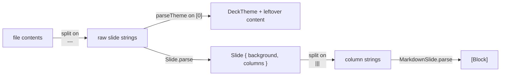

# markdown-parsing

The hand-rolled deck → slide → block parser and the exact directive grammar it accepts.

## Purpose

Turn a `.md` file into `[Slide]`, and each slide's column text into `[Block]`
for rendering. There is **no Markdown library** — everything is line-prefix
matching plus two regexes. If a construct isn't listed here, it isn't
supported; it renders as a literal paragraph.

## Three parsing stages



### Stage 1 — slides

`Deck.load` splits the whole file on the exact string `"\n---\n"`. A `---`
with trailing spaces, or at the very start/end of the file with no
surrounding newline, will not split.

The **first** raw slide is passed to `parseTheme`. If it contains a `## Theme`
or `# Theme` heading, the key/value lines under it are consumed as
configuration and the remainder of that slide is kept as real content (dropped
entirely if empty). Any subsequent `#`/`##`/`###` heading terminates the theme
block.

### Stage 2 — one slide

`Slide.parse` scans lines for HTML comments and extracts three directives —
`bg:` into `background: String?`, `gradient:` into
`gradient: SlideGradient?`, and `skip` into `skipped: Bool`. Remaining lines
are joined, trimmed, and split on
the exact string `"\n|||\n"` into `columns`. One column is the normal case;
two produce a side-by-side layout.

Directive rules, all of which matter:

- Only a line whose **trimmed form starts with** `<!--` is considered. This is
  what keeps `` `<!-- bg: path -->` `` quoted mid-sentence in prose inert —
  and the sample decks rely on it.
- A comment may **span multiple lines**. If the opening line does not end with
  `-->`, subsequent lines accumulate until one does. Gradient specs are long
  enough to want wrapping.
- An **unterminated** comment is appended to the body verbatim rather than
  swallowing the rest of the slide.
- A closed comment that **no directive claims is dropped**. That is what makes
  `<!-- note -->` a plain comment. (Before `v0.7.0` such comments rendered as
  literal paragraphs and there was no comment syntax at all.)
- `<!-- cursor -->` (equivalently `cursor:last`) and `<!-- cursor:lastline -->`
  set `cursor: SlideCursor?`. An unrecognized argument falls back to `.last`.
- `<!-- skip -->` marks the slide `skipped`, and `Deck.load` filters those out
  before building the `Deck` — so page labels and PDF pages count only the
  slides actually shown. If *every* slide is skipped the deck falls back to a
  single "Every slide is skipped" placeholder rather than being empty.

### Stage 3 — blocks

`MarkdownSlide.parse` walks lines and emits:

```swift
enum Block {
    case heading(Int, String)                              // 1, 2, or 3
    case bullet(String)
    case paragraph(String)
    case image(alt: String, path: String)
    case slideshow(alt: String, paths: [String])
    case youtube(videoId: String, start: Int, alt: String)
    case code(language: String, source: String)
    case blank
}
```

Matching order matters — it is checked top to bottom:

1. A line whose trimmed form starts with ` ``` ` opens a fenced code block.
   The text after the backticks is the language. Everything until the next
   line starting with ` ``` ` is captured verbatim. **An unterminated fence
   swallows the rest of the column.**
2. `parseImage` regex `^\s*!\[([^\]]*)\]\(([^)]+)\)\s*$` — the image must be
   alone on its line. The captured path then goes through `splitPaths`: two or
   more comma-separated, all-non-empty pieces become a `.slideshow`; otherwise
   a YouTube URL becomes `.youtube` and anything else `.image`. A path that
   itself contains a comma will be misread as two paths — rename the file.
3. `# `, `## `, `### ` prefixes → headings. Checked against the **untrimmed**
   line, so a leading space defeats them. Four or more `#` is not a heading.
4. `- ` or `* ` prefix → bullet. Also untrimmed, so nested/indented bullets
   are not recognized — they fall through to paragraph.
5. Empty (after trimming) → `.blank`.
6. Anything else → `.paragraph`.

## Inline formatting is not parsed here

Headings, bullets, and paragraphs pass their text through a private `inline`
helper at render time:

```swift
(try? AttributedString(markdown: s)) ?? AttributedString(s)
```

That is Foundation's full CommonMark **inline** parser, so `**bold**`,
`*italic*`, `` `code` ``, `[links](url)`, `~~strikethrough~~`, and the rest
all work even though nothing in this file mentions them. On a parse failure it
degrades to plain text rather than throwing.

The line-prefix parser above is only about **block** structure. That is why
the supported-syntax list looks so small: block syntax is hand-rolled and
narrow, inline syntax is delegated and broad.

## Directive reference

| Syntax | Effect |
|---|---|
| `---` alone on a line | New slide |
| `\|\|\|` alone on a line | Split the slide into two columns |
| `<!-- bg: path -->` | Per-slide background image |
| `<!-- gradient: k=v ... -->` | Per-slide gradient overlay |
| `<!-- skip -->` | Drop the slide from the deck entirely |
| `<!-- cursor -->` | Blinking cursor below the content (`cursor:last`) |
| `<!-- cursor:lastline -->` | Blinking cursor at the end of the last line |
| `<!-- anything else -->` | Comment — dropped, never rendered |
| ` ```lang ` fence | Syntax-highlighted code block |
| `` | Image, alone on its line |
| `` | YouTube embed, alone on its line |
| `## Theme` block, first slide only | Deck theme configuration |

## The blinking cursor

`MarkdownSlide` draws it, and two details are load-bearing:

- The blink is a `TimelineView(.periodic)` wrapped around **only the block that
  carries the cursor**, not the slide. A `@State` + `Timer` on the slide would
  re-run `Self.parse(text)` twice a second for every deck.
- The cursor is an `AttributedString` run appended to that block's text, toggled
  between `theme.textColor` and `.clear`. Keeping it inside the text run is what
  puts `cursor:lastline` on the last *visual* line of a wrapped paragraph — an
  adjacent view in an `HStack` would sit beside the whole block instead.
- `staticCursor` (set from `SlideCanvas.staticBackgrounds`) draws it solid, so a
  PDF export does not catch whichever half of the blink cycle it lands in.
- `cursor:lastline` needs a heading, bullet, or paragraph to follow. A slide
  ending in an image or code block has none, so it falls back to `.last`.

## Image path resolution

Paths in `` resolve relative to the deck's `baseDir` (the
directory containing the `.md` file). Absolute paths and `~/...` are also
accepted. Backgrounds from `<!-- bg: ... -->` resolve the same way.

A background whose extension is `.svg` takes a different path: instead of
being loaded as an `NSImage`, the file's contents are inlined into a minimal
HTML document and rendered live in a `WKWebView`. This is deliberate — a
rasterized SVG would be a still frame, whereas the live web view lets SMIL and
CSS animations inside the SVG actually play.

## Failure behavior

- Unreadable or missing file → a built-in three-slide fallback deck is used
  instead of erroring.
- Unknown `template:` name → falls back to the default theme silently.
- Malformed hex color → that swatch falls back to the template's silently.
- A directory path is not an error — it loads as a photo deck.

There are no tests. Changes here are verified by running a deck through the
app and looking at the result.
