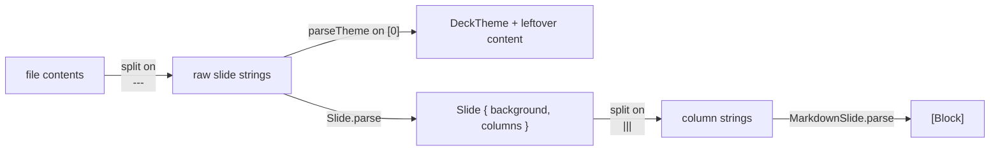

# markdown-parsing

The hand-rolled deck → slide → block parser and the exact directive grammar it accepts.

## Purpose

Turn a `.md` file into `[Slide]`, and each slide's column text into `[Block]`
for rendering. There is **no Markdown library** — everything is line-prefix
matching plus two regexes. If a construct isn't listed here, it isn't
supported; it renders as a literal paragraph.

## Three parsing stages



### Stage 1 — slides

`Deck.load` splits the whole file on the exact string `"\n---\n"`. A `---`
with trailing spaces, or at the very start/end of the file with no
surrounding newline, will not split.

The **first** raw slide is passed to `parseTheme`. If it contains a `## Theme`
or `# Theme` heading, the key/value lines under it are consumed as
configuration and the remainder of that slide is kept as real content (dropped
entirely if empty). Any subsequent `#`/`##`/`###` heading terminates the theme
block.

### Stage 2 — one slide

`Slide.parse` scans lines for HTML comments and extracts `bg:` directives,
producing `background: String?`. Remaining lines are joined, trimmed, and
split on the exact string `"\n|||\n"` into `columns`. One column is the normal
case; two produce a side-by-side layout.

### Stage 3 — blocks

`MarkdownSlide.parse` walks lines and emits:

```swift
enum Block {
    case heading(Int, String)                              // 1, 2, or 3
    case bullet(String)
    case paragraph(String)
    case image(alt: String, path: String)
    case youtube(videoId: String, start: Int, alt: String)
    case code(language: String, source: String)
    case blank
}
```

Matching order matters — it is checked top to bottom:

1. A line whose trimmed form starts with ` ``` ` opens a fenced code block.
   The text after the backticks is the language. Everything until the next
   line starting with ` ``` ` is captured verbatim. **An unterminated fence
   swallows the rest of the column.**
2. `parseImage` regex `^\s*!\[([^\]]*)\]\(([^)]+)\)\s*$` — the image must be
   alone on its line. If the captured path parses as a YouTube URL it becomes
   `.youtube`, otherwise `.image`.
3. `# `, `## `, `### ` prefixes → headings. Checked against the **untrimmed**
   line, so a leading space defeats them. Four or more `#` is not a heading.
4. `- ` or `* ` prefix → bullet. Also untrimmed, so nested/indented bullets
   are not recognized — they fall through to paragraph.
5. Empty (after trimming) → `.blank`.
6. Anything else → `.paragraph`.

Inline `**bold**`, `*italic*`, and `` `code` `` are handled at render time
inside the heading/bullet/paragraph renderers, not by this parser.

## Directive reference

| Syntax | Effect |
|---|---|
| `---` alone on a line | New slide |
| `\|\|\|` alone on a line | Split the slide into two columns |
| `<!-- bg: path -->` | Per-slide background image |
| ` ```lang ` fence | Syntax-highlighted code block |
| `` | Image, alone on its line |
| `` | YouTube embed, alone on its line |
| `## Theme` block, first slide only | Deck theme configuration |

## Image path resolution

Paths in `` resolve relative to the deck's `baseDir` (the
directory containing the `.md` file). Absolute paths and `~/...` are also
accepted. Backgrounds from `<!-- bg: ... -->` resolve the same way. A `.svg`
background is rendered through a `WKWebView` rather than `NSImage`.

## Failure behavior

- Unreadable or missing file → a built-in three-slide fallback deck is used
  instead of erroring.
- Unknown `template:` name → falls back to the default theme silently.
- Malformed hex color → that swatch falls back to the template's silently.
- A directory path is not an error — it loads as a photo deck.

There are no tests. Changes here are verified by running a deck through the
app and looking at the result.
