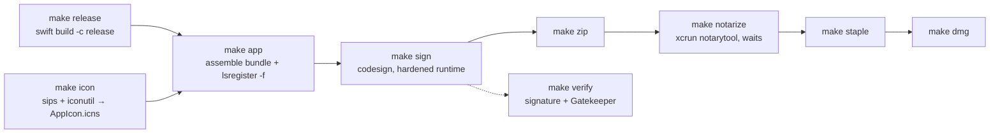

# packaging

Building, signing, notarizing, versioning, and shipping the `.app` — all driven by the Makefile.

## Purpose

Turn a SwiftPM executable into a Developer ID–signed, notarized, stapled
`ScreenPresenter.app` and `.dmg`, with document-type associations registered
so Finder can open `.md` files with it.

## Everyday commands

```sh
swift build                                   # debug into .build/
swift run                                     # default deck (./sample.md)
swift run ScreenPresenter deck.md             # specific deck
swift run ScreenPresenter deck.md template=ocean
make app                                      # full .app bundle
make open                                     # launch the built .app
```

`make` with no target prints the target list (`help` is the default).

## Pipeline



Each target declares the previous one as a prerequisite (`sign: app`,
`zip: sign`, `dmg: staple`), so `make dmg` runs the whole chain.

## Bundle assembly

`make app` builds `build/ScreenPresenter.app` and:

- substitutes version placeholders into `Resources/Info.plist.template`
- copies `build/AppIcon.icns`, `sample.md`, `images/`, and the bundled
  `Fonts/` into `Contents/Resources/`
- runs `lsregister -f` on the bundle so Finder picks up document-type
  associations without a restart

`make register` does that `lsregister -f` step standalone — useful after
moving the `.app` somewhere else.

`Info.plist` sets `LSUIElement` (dockless by default) and
`NSAllowsLocalNetworking=true`, a narrow App Transport Security exception
permitting cleartext http only to loopback and `.local` hosts. Nothing else
in the app makes http requests.

`Resources/entitlements.plist` is deliberately minimal — it exists to enable
the hardened runtime, which notarization requires.

## Versioning

The displayed version is `a.b.c (d)`:

- **`a.b.c`** — marketing version read from the `VERSION` file, written to
  `CFBundleShortVersionString`
- **`d`** — build number from `git rev-list --count HEAD` (falls back to `0`
  outside a git repo), written to `CFBundleVersion`

Both are substituted into `Info.plist` at `make app` time, so a plain
`swift run` does not reflect them.

```sh
make version       # e.g. "0.2.0 (14)"
make bump-patch    # 0.2.0 -> 0.2.1
make bump-minor    # 0.2.0 -> 0.3.0
make bump-major    # 0.2.0 -> 1.0.0
```

## Credentials

Copy `.env.example` to `.env` (gitignored) and fill in:

```sh
SIGNING_IDENTITY = Developer ID Application: Your Name (TEAMID)
APPLE_ID         = you@example.com
TEAM_ID          = XXXXXXXXXX
APP_PASSWORD     = xxxx-xxxx-xxxx-xxxx   # app-specific password
```

`.env` may also override `APP_NAME`, `DISPLAY_NAME`, and `BUNDLE_ID` — all
declared with `?=` so the environment wins. Signing, notarizing, and stapling
fail without these; `make app` does not need them.

## Requirements

macOS 13+, Xcode command-line tools (`swift`, `codesign`, `sips`,
`iconutil`, `xcrun notarytool`), and an Apple Developer ID certificate for
the signing half of the pipeline. `icon.png` must be 1024×1024.

## Notes

- `make clean` removes `build/`; it does not touch `.build/`.
- Notarization is a network round-trip — `make notarize` submits the zip and
  blocks until Apple returns a result, which can take minutes.
- Committing a bumped `VERSION` also changes the build number, since it is
  derived from commit count.
