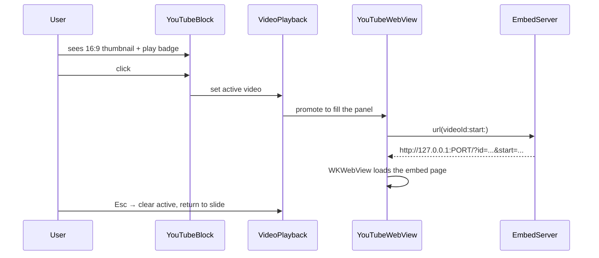

# youtube-embeds

Playing YouTube videos inside the panel, and the loopback HTTP server that makes the IFrame API accept them.

## Trigger

A markdown line of the form `` where the URL points at YouTube.
The block parser routes it to `.youtube(videoId:start:alt:)` instead of
`.image`.

## Accepted URL forms

| Form | Where the ID comes from |
|---|---|
| `https://youtu.be/VIDEO_ID` | first path component |
| `https://www.youtube.com/watch?v=VIDEO_ID` | `v` query item |
| `https://www.youtube.com/embed/VIDEO_ID` | second path component |
| `https://www.youtube.com/shorts/VIDEO_ID` | second path component |
| `https://www.youtube.com/live/VIDEO_ID` | second path component |
| `https://www.youtube.com/v/VIDEO_ID` | second path component |

`youtube-nocookie.com` and `*.youtu.be` hosts are matched too. Anything that
doesn't yield a non-empty ID falls back to being treated as a plain image.

## Start offset

Supplied via `?t=` or `?start=`. `parseDuration` accepts a bare integer
(seconds) or a compound of `h`/`m`/`s` — `20`, `20s`, `1m30s`, `1h2m3s`.
Unrecognized characters are ignored, and a trailing bare number is added as
seconds. Unparseable input yields `0`.

## Flow

Before being clicked the block renders as a 16:9 thumbnail with a play badge —
no `WKWebView` is instantiated until playback starts.

`VideoPlayback` is an `ObservableObject` holding the currently active video.
While it is non-nil, `Controller` installs `videoKeyMonitor` so Esc closes the
video rather than the panel, and Space/arrows close the video while also
navigating slides.

`PassiveWebView` is a `WKWebView` subclass used so the web view does not steal
first-responder status and swallow the presenter's key handling.

## Why a local HTTP server

The YouTube IFrame API rejects `file://` and the synthetic origin that
`WKWebView.loadHTMLString` produces — the player needs a real http origin.

`EmbedServer` is a singleton that starts an `NWListener` over TCP bound to
`127.0.0.1` on an OS-assigned port (`port: .any`), on a dedicated
`DispatchQueue`. It serves a minimal HTML page that instantiates the IFrame
player from the `id` and `start` query parameters.

Startup is asynchronous, so `url(videoId:start:)` blocks on a
`DispatchSemaphore` for up to **2 seconds** waiting for the listener to reach
`.ready`. If the listener fails or times out, `port` stays `0` and the method
returns `nil` — playback silently does nothing rather than crashing. The
semaphore is signalled exactly once, guarded by a `didSignal` flag, on either
`.ready` or `.failed`/`.cancelled`.

The bundle therefore ships `NSAllowsLocalNetworking=true` in `Info.plist`.
That ATS exception permits cleartext http **only** to loopback and `.local`
hosts; no other http traffic is allowed, and nothing else in the app makes
http requests.

## Failure modes

- No network at all → the thumbnail still renders (it is fetched from
  YouTube's image CDN over https, so it will be blank offline), and clicking
  produces a player that cannot load.
- Listener fails to bind → clicks do nothing; the failure is logged via
  `NSLog` at startup.
- A video that disallows embedding → the player surfaces YouTube's own error
  inside the web view; the app has no special handling for it.
