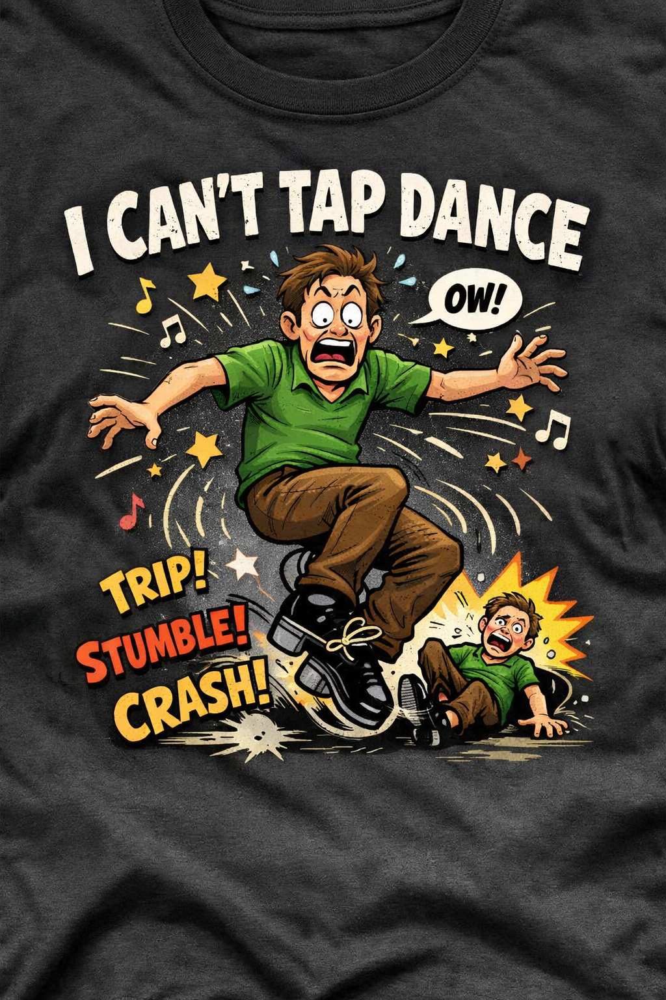

<!-- bg: images/boat.jpg -->

# Screen Presenter

A minimal overlay for macOS.

Move your mouse to the **top-right corner** to open.

---

## Controls

- **Space** or **→** — next slide
- **←** — previous slide
- **Esc** or click outside — dismiss
- **⌘P** — export this deck as a PDF
* Hold **Shift** while hovering the corner for live settings

Bullets take `-` or `*`.

---

## Text formatting

### Headings go three levels deep

`#`, `##`, and `###` — this line is an `###`.

Inline styling is full markdown: **bold**, *italic*, `inline code`,
[links](https://github.com/epatel/ScreenPresenter), and ~~strikethrough~~.

- Mix them freely — ***bold italic***, or *emphasis around `code`*
- Only block structure is limited; tables and blockquotes are not supported

---

<!-- cursor -->

## Blinking cursor

`<!-- cursor -->` parks a blinking block on its own line below the content.

---

<!-- cursor:lastline -->

## Cursor on the last line

`<!-- cursor:lastline -->` appends it to the end of the last line of text
instead — even when that line wraps.

---

## Two-column slide

Use `|||` on its own line to split a slide.

- Text flows independently
- Columns render side-by-side
- Spacing is automatic

|||



---

## Inline image


Paths are relative to the `.md` file.

---

<!-- A plain comment. Anything the directives do not claim is dropped, so this
     line never renders. -->

## Slideshow


Comma-separated paths cross-fade in place, in the aspect of the largest image.

---

<!-- skip -->

## You should never see this slide

`<!-- skip -->` drops the whole slide from the deck, so the page counter never
counts it.

---

## YouTube


Click the thumbnail to play full-panel. **Esc** closes the video and returns
here; **Space** or the arrows close it and move on.

|||

### Any YouTube URL works

- `youtu.be/ID`
- `youtube.com/watch?v=ID`
- `youtube.com/shorts/ID`
- `youtube.com/embed/ID`

Start offsets take `?t=` or `?start=`, as seconds (`20`) or a
compound (`1m30s`, `1h2m3s`).

---

## Same video, long-form URL


A `watch?v=` link with a compound offset — starts 90 seconds in.

---

## Syntax highlighting

```swift
struct Slide {
    let background: String?
    let columns: [String]
}

func render(_ slide: Slide) -> some View {
    Text(slide.columns.first ?? "")
        .font(.system(size: 24))
}
```

Fenced blocks — supply a language after the opening fence.

---

## Two-column code

Explanation of the snippet.

- Uses Highlightr
- Theme: atom-one-dark
- 190+ languages

|||

```python
def fib(n):
    a, b = 0, 1
    for _ in range(n):
        a, b = b, a + b
    return a
```

---

<!-- bg: images/boat.jpg -->

# Background image

Use `<!-- bg: path -->` anywhere in a slide.

A dark overlay is applied automatically for readability.

---

<!-- bg: images/boat.jpg -->

## Background + columns

Background image shows through both columns.

|||


---

<!-- bg: images/animated-bg.svg -->

# SVG backgrounds

This background is animated — the glows drift, the waves morph, the stars
twinkle. Give it a few seconds.

An `.svg` renders live in a web view instead of being flattened to a still
image, so SMIL and CSS animations inside the file keep playing.

Raster and vector use the same `<!-- bg: path -->` directive — the extension
decides.

---

<!-- bg: images/boat.jpg -->
<!-- gradient: angle=0 from=0.6 to=1 start=#000000@0.85 end=#000000@0.0 -->

# Gradient scrim

A gradient replaces the flat darken overlay, so you choose where the
darkening sits instead of dimming the whole photo evenly.

This one holds 85% black across the top 60% — the whole text area — then
fades out over the remaining 40%, reaching fully clear at the bottom edge.
The photo reads through along the bottom strip.

Widen the plateau by raising `from`; move the reveal by changing `to`.

---

<!-- gradient: angle=135 from=0.1 to=0.9 start=#3a1d52@1.0 end=#0f1733@1.0 -->

# Gradient as background

With no `<!-- bg: -->` at all, the gradient becomes the background itself —
drawn over the theme's fill colour.

- `angle` — degrees; `0` is top-to-bottom, increasing clockwise
- `from` / `to` — where the fade starts and finishes, `0`–`1`
- `start` / `end` — `#rrggbb` or `#rrggbb@alpha`

The start colour holds from `0` to `from`, fades across to the end colour by
`to`, then holds through to `1`. This one runs diagonally at 135°.

---

## Point it at a folder

Give the app a **directory** instead of a `.md` file and it builds a photo
deck: one slide per image, sorted the way Finder sorts them.

```bash
swift run ScreenPresenter ~/Pictures/trip
open -a ScreenPresenter.app ~/Pictures/trip
```

Images fill the panel with no darkening overlay. Handles jpg, png, heic,
gif, webp, tiff, and bmp.
